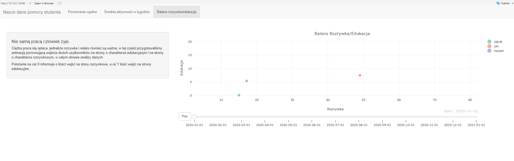

# Projekt JA - Analiza historii przeglądania.
Projekt wykonany w ramach przedmiotu Techniki Wizualizacji Danych.

Autorzy: Kacper Grzymkowski, Jakub Fołtyn i Jan Gąska

[Aplikacja na shinyapps.io](http://grzymkowskik.shinyapps.io/dashboard)

## Struktura folderów:
* scripts - skrypty przetwarzające dane
* raw_data - pliki .json pobrane z Google Takeout. Ukryte z powodów prywatności.
* data - przetworzone dane z plików .json
* dashboard - kod aplikacji

## Screenshoty

